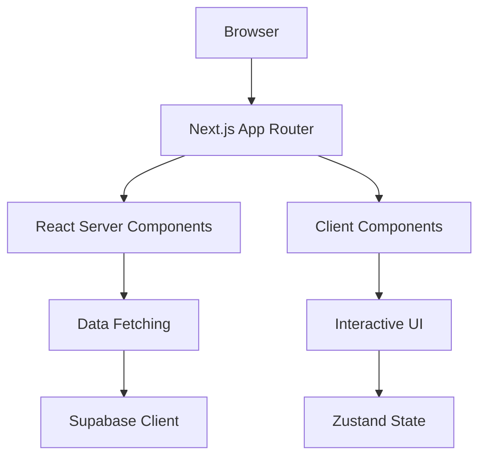
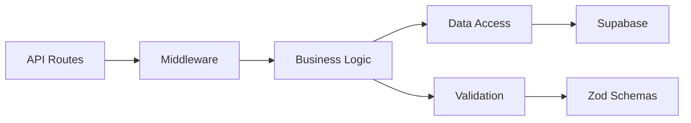
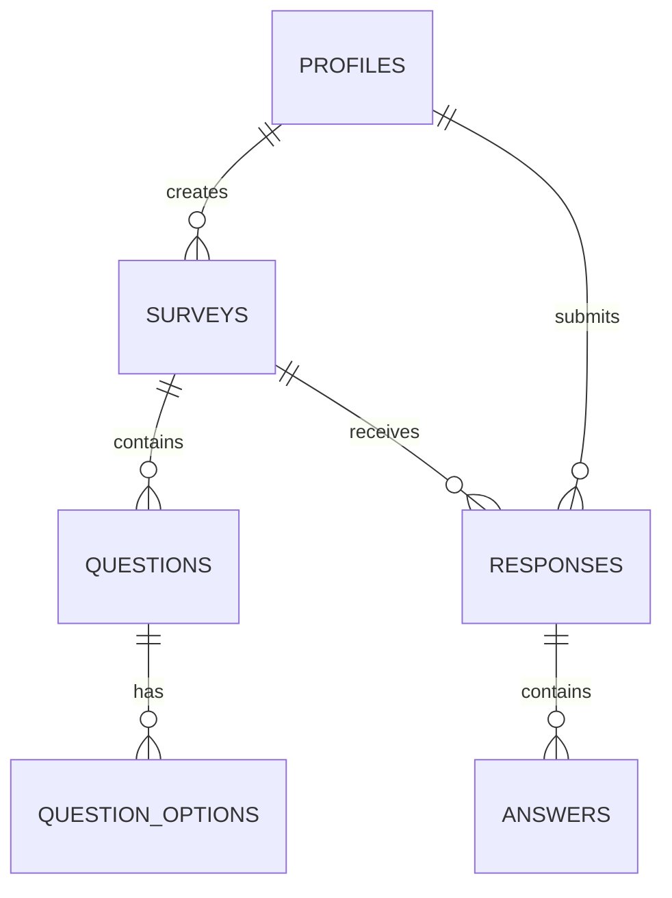
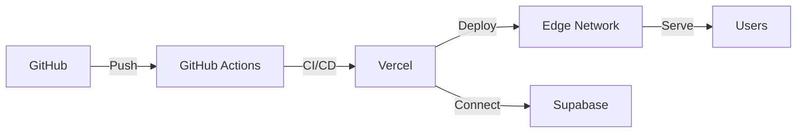

# System Architecture Overview

## Executive Summary

The Healthcare Survey Dashboard is a modern, full-stack web application built with Next.js 15, TypeScript, and Tailwind CSS. It follows a serverless, component-driven architecture optimized for performance, scalability, and developer experience.

## Architecture Principles

1. **Separation of Concerns**: Clear boundaries between presentation, business logic, and data layers
2. **Type Safety**: End-to-end TypeScript with strict mode and comprehensive type definitions
3. **Security First**: Defense-in-depth with input sanitization, CSP headers, and RLS policies
4. **Performance Optimized**: Code splitting, lazy loading, and edge caching
5. **Progressive Enhancement**: Core functionality works without JavaScript
6. **Accessibility**: WCAG 2.2 AA compliance throughout

## System Components

### Frontend Layer

**Technologies:**
- **Framework**: Next.js 15 with App Router
- **UI Library**: React 19
- **Styling**: Tailwind CSS + shadcn/ui
- **State Management**: React Context + Local Storage
- **Data Visualization**: Vega-Lite
- **Form Handling**: Zod + Custom Hooks

### Backend Layer

**Technologies:**
- **Runtime**: Node.js 18+ on Vercel Edge
- **API**: Next.js Route Handlers
- **Authentication**: Supabase Auth
- **Validation**: Zod schemas
- **Security**: DOMPurify, CSRF tokens

### Data Layer

**Technologies:**
- **Database**: PostgreSQL (via Supabase)
- **ORM**: Supabase Client SDK
- **Caching**: Next.js Data Cache
- **File Storage**: Supabase Storage
- **Real-time**: Supabase Realtime

## Data Flow

### Survey Creation Flow
1. Admin creates survey via UI
2. Client validates with Zod schema
3. Data sanitized with DOMPurify
4. API route processes request
5. RLS policies check permissions
6. Data persisted to PostgreSQL
7. Cache invalidated
8. UI updates optimistically

### Survey Response Flow
1. User accesses survey link
2. Server renders initial HTML
3. Client hydrates for interactivity
4. Responses saved to localStorage
5. On submit, data validated
6. API processes submission
7. Analytics updated async
8. Confirmation rendered

## Security Architecture

### Defense Layers
1. **Input Validation**: Zod schemas on all inputs
2. **Sanitization**: DOMPurify for XSS prevention
3. **Authentication**: Supabase Auth with JWT
4. **Authorization**: Row-Level Security in PostgreSQL
5. **Rate Limiting**: Vercel Edge middleware
6. **CSP Headers**: Strict Content Security Policy
7. **HTTPS**: Enforced via Vercel

### Data Protection
- Passwords: bcrypt with salt rounds
- Tokens: Secure, HttpOnly cookies
- PII: Encrypted at rest
- Backups: Automated daily

## Performance Architecture

### Optimization Strategies
1. **Server Components**: Reduce client bundle
2. **Dynamic Imports**: Code splitting for charts
3. **Image Optimization**: Next.js Image component
4. **Font Loading**: Variable fonts with subsetting
5. **Caching**: ISR with 60s revalidation
6. **CDN**: Vercel Edge Network

### Performance Budgets
- First Contentful Paint: <1.5s
- Largest Contentful Paint: <2.5s
- Time to Interactive: <3.5s
- Cumulative Layout Shift: <0.1
- JavaScript Bundle: <200KB

## Deployment Architecture

### Environments
- **Development**: Local with mock data
- **Preview**: Vercel preview deployments
- **Staging**: Protected branch deployment
- **Production**: Main branch auto-deploy

## Monitoring & Observability

### Metrics Collection
- **Application**: Vercel Analytics
- **Performance**: Web Vitals
- **Errors**: Sentry integration
- **Usage**: Supabase Analytics
- **Custom**: PostHog events

### Alerting
- Error rate > 1%
- Response time > 3s
- Database connection failures
- Authentication failures
- Storage quota warnings

## Scalability Considerations

### Horizontal Scaling
- Stateless application servers
- Database connection pooling
- CDN for static assets
- Queue for async processing

### Vertical Scaling
- Database read replicas
- Increased connection limits
- Enhanced compute resources
- Premium CDN tier

## Disaster Recovery

### Backup Strategy
- Database: Daily automated backups
- Code: Git version control
- Configuration: Environment variables in Vercel
- User uploads: Supabase Storage replication

### Recovery Procedures
1. Identify failure point
2. Restore from last known good state
3. Verify data integrity
4. Re-run failed transactions
5. Notify affected users

## Future Architecture Considerations

### Potential Enhancements
1. **Microservices**: Extract analytics service
2. **GraphQL**: Replace REST with GraphQL
3. **WebSockets**: Real-time survey responses
4. **AI Integration**: Smart survey recommendations
5. **Multi-tenancy**: Organization isolation
6. **Internationalization**: Multi-language support

## Architecture Decision Records

See [ADR-0001](./adr/ADR-0001-tech-stack.md) for detailed technology decisions.