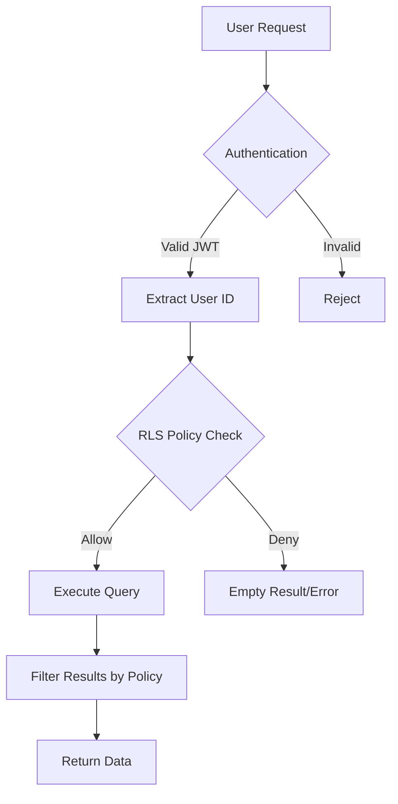

# Row-Level Security (RLS) Policies

## Overview

Row-Level Security (RLS) in PostgreSQL provides fine-grained access control at the database level. This document defines all RLS policies for the Healthcare Survey Dashboard, ensuring data isolation and security.

## Policy Architecture

### Security Model



### Policy Principles

1. **Deny by Default**: All tables have RLS enabled with restrictive defaults
2. **Least Privilege**: Users only access data they explicitly need
3. **Context-Aware**: Policies consider user role, ownership, and permissions
4. **Performance**: Policies use indexed columns for efficient filtering
5. **Auditability**: All access attempts are logged

## Enable RLS on Tables

```sql
-- Enable RLS on all tables
ALTER TABLE profiles ENABLE ROW LEVEL SECURITY;
ALTER TABLE surveys ENABLE ROW LEVEL SECURITY;
ALTER TABLE questions ENABLE ROW LEVEL SECURITY;
ALTER TABLE question_options ENABLE ROW LEVEL SECURITY;
ALTER TABLE responses ENABLE ROW LEVEL SECURITY;
ALTER TABLE answers ENABLE ROW LEVEL SECURITY;
ALTER TABLE survey_shares ENABLE ROW LEVEL SECURITY;
```

## Profiles Table Policies

### View Own Profile
Users can view their own profile.

```sql
CREATE POLICY "Users can view own profile" 
ON profiles FOR SELECT
USING (auth.uid() = user_id);
```

### Update Own Profile
Users can update their own profile.

```sql
CREATE POLICY "Users can update own profile"
ON profiles FOR UPDATE
USING (auth.uid() = user_id)
WITH CHECK (auth.uid() = user_id);
```

### Admin View All
Admins can view all profiles.

```sql
CREATE POLICY "Admins can view all profiles"
ON profiles FOR SELECT
USING (
    EXISTS (
        SELECT 1 FROM profiles
        WHERE user_id = auth.uid()
        AND role = 'admin'
    )
);
```

### Insert Profile on Signup
Allow profile creation during user registration.

```sql
CREATE POLICY "Enable insert for authentication"
ON profiles FOR INSERT
WITH CHECK (auth.uid() = user_id);
```

## Surveys Table Policies

### View Own Surveys
Users can view surveys they created.

```sql
CREATE POLICY "Users can view own surveys"
ON surveys FOR SELECT
USING (
    created_by IN (
        SELECT id FROM profiles WHERE user_id = auth.uid()
    )
);
```

### View Shared Surveys
Users can view surveys shared with them.

```sql
CREATE POLICY "Users can view shared surveys"
ON surveys FOR SELECT
USING (
    id IN (
        SELECT survey_id FROM survey_shares
        WHERE shared_with IN (
            SELECT id FROM profiles WHERE user_id = auth.uid()
        )
        AND (expires_at IS NULL OR expires_at > NOW())
    )
);
```

### View Active Public Surveys
Anyone can view active public surveys.

```sql
CREATE POLICY "Anyone can view active public surveys"
ON surveys FOR SELECT
USING (
    status = 'active'
    AND deleted_at IS NULL
    AND (settings->>'allowAnonymous')::boolean = true
    AND (settings->>'startDate' IS NULL OR (settings->>'startDate')::timestamptz <= NOW())
    AND (settings->>'endDate' IS NULL OR (settings->>'endDate')::timestamptz >= NOW())
);
```

### Create Surveys
Authenticated users can create surveys.

```sql
CREATE POLICY "Authenticated users can create surveys"
ON surveys FOR INSERT
WITH CHECK (
    auth.uid() IS NOT NULL
    AND created_by IN (
        SELECT id FROM profiles WHERE user_id = auth.uid()
    )
);
```

### Update Own Surveys
Users can update their own surveys.

```sql
CREATE POLICY "Users can update own surveys"
ON surveys FOR UPDATE
USING (
    created_by IN (
        SELECT id FROM profiles WHERE user_id = auth.uid()
    )
)
WITH CHECK (
    created_by IN (
        SELECT id FROM profiles WHERE user_id = auth.uid()
    )
);
```

### Update Shared Surveys with Edit Permission
Users can update surveys shared with edit permission.

```sql
CREATE POLICY "Users can update shared surveys with edit permission"
ON surveys FOR UPDATE
USING (
    id IN (
        SELECT survey_id FROM survey_shares
        WHERE shared_with IN (
            SELECT id FROM profiles WHERE user_id = auth.uid()
        )
        AND permission IN ('edit', 'admin')
        AND (expires_at IS NULL OR expires_at > NOW())
    )
);
```

### Delete Own Surveys
Users can soft delete their own surveys.

```sql
CREATE POLICY "Users can delete own surveys"
ON surveys FOR UPDATE
USING (
    created_by IN (
        SELECT id FROM profiles WHERE user_id = auth.uid()
    )
)
WITH CHECK (
    created_by IN (
        SELECT id FROM profiles WHERE user_id = auth.uid()
    )
    AND deleted_at IS NOT NULL  -- Only allow setting deleted_at
);
```

## Questions Table Policies

### View Questions for Accessible Surveys
Users can view questions for surveys they can access.

```sql
CREATE POLICY "Users can view questions for accessible surveys"
ON questions FOR SELECT
USING (
    survey_id IN (
        SELECT id FROM surveys
        -- This will be filtered by survey policies
    )
);
```

### Manage Questions for Own Surveys
Users can manage questions for their own surveys.

```sql
CREATE POLICY "Users can manage questions for own surveys"
ON questions FOR ALL
USING (
    survey_id IN (
        SELECT id FROM surveys
        WHERE created_by IN (
            SELECT id FROM profiles WHERE user_id = auth.uid()
        )
    )
)
WITH CHECK (
    survey_id IN (
        SELECT id FROM surveys
        WHERE created_by IN (
            SELECT id FROM profiles WHERE user_id = auth.uid()
        )
    )
);
```

### Manage Questions for Editable Shared Surveys
Users can manage questions for surveys shared with edit permission.

```sql
CREATE POLICY "Users can manage questions for editable shared surveys"
ON questions FOR ALL
USING (
    survey_id IN (
        SELECT survey_id FROM survey_shares
        WHERE shared_with IN (
            SELECT id FROM profiles WHERE user_id = auth.uid()
        )
        AND permission IN ('edit', 'admin')
        AND (expires_at IS NULL OR expires_at > NOW())
    )
);
```

## Question Options Table Policies

### View Options for Accessible Questions
Users can view options for questions they can access.

```sql
CREATE POLICY "Users can view options for accessible questions"
ON question_options FOR SELECT
USING (
    question_id IN (
        SELECT id FROM questions
        -- This will be filtered by question policies
    )
);
```

### Manage Options for Own Survey Questions
Users can manage options for their own survey questions.

```sql
CREATE POLICY "Users can manage options for own survey questions"
ON question_options FOR ALL
USING (
    question_id IN (
        SELECT q.id FROM questions q
        JOIN surveys s ON q.survey_id = s.id
        WHERE s.created_by IN (
            SELECT id FROM profiles WHERE user_id = auth.uid()
        )
    )
);
```

## Responses Table Policies

### View Own Responses
Users can view their own responses.

```sql
CREATE POLICY "Users can view own responses"
ON responses FOR SELECT
USING (
    respondent_id IN (
        SELECT id FROM profiles WHERE user_id = auth.uid()
    )
);
```

### View Responses for Own Surveys
Survey creators can view all responses to their surveys.

```sql
CREATE POLICY "Survey creators can view responses"
ON responses FOR SELECT
USING (
    survey_id IN (
        SELECT id FROM surveys
        WHERE created_by IN (
            SELECT id FROM profiles WHERE user_id = auth.uid()
        )
    )
);
```

### View Responses for Shared Surveys
Users can view responses for surveys shared with appropriate permission.

```sql
CREATE POLICY "Users can view responses for shared surveys"
ON responses FOR SELECT
USING (
    survey_id IN (
        SELECT survey_id FROM survey_shares
        WHERE shared_with IN (
            SELECT id FROM profiles WHERE user_id = auth.uid()
        )
        AND permission IN ('view', 'edit', 'admin')
        AND (expires_at IS NULL OR expires_at > NOW())
    )
);
```

### Create Response for Active Surveys
Users can submit responses to active surveys.

```sql
CREATE POLICY "Users can submit responses to active surveys"
ON responses FOR INSERT
WITH CHECK (
    survey_id IN (
        SELECT id FROM surveys
        WHERE status = 'active'
        AND deleted_at IS NULL
        AND (
            -- Public survey
            (settings->>'allowAnonymous')::boolean = true
            OR
            -- Authenticated user
            auth.uid() IS NOT NULL
        )
        AND (settings->>'startDate' IS NULL OR (settings->>'startDate')::timestamptz <= NOW())
        AND (settings->>'endDate' IS NULL OR (settings->>'endDate')::timestamptz >= NOW())
    )
    AND (
        -- Anonymous response
        respondent_id IS NULL
        OR
        -- Own response
        respondent_id IN (
            SELECT id FROM profiles WHERE user_id = auth.uid()
        )
    )
);
```

### Update Own Incomplete Responses
Users can update their own incomplete responses.

```sql
CREATE POLICY "Users can update own incomplete responses"
ON responses FOR UPDATE
USING (
    respondent_id IN (
        SELECT id FROM profiles WHERE user_id = auth.uid()
    )
    AND status != 'completed'
)
WITH CHECK (
    respondent_id IN (
        SELECT id FROM profiles WHERE user_id = auth.uid()
    )
);
```

## Answers Table Policies

### View Answers for Accessible Responses
Users can view answers for responses they can access.

```sql
CREATE POLICY "Users can view answers for accessible responses"
ON answers FOR SELECT
USING (
    response_id IN (
        SELECT id FROM responses
        -- This will be filtered by response policies
    )
);
```

### Create Answers for Own Responses
Users can create answers for their own responses.

```sql
CREATE POLICY "Users can create answers for own responses"
ON answers FOR INSERT
WITH CHECK (
    response_id IN (
        SELECT id FROM responses
        WHERE (
            respondent_id IN (
                SELECT id FROM profiles WHERE user_id = auth.uid()
            )
            OR
            -- Anonymous response in current session
            (respondent_id IS NULL AND created_at > NOW() - INTERVAL '1 hour')
        )
        AND status != 'completed'
    )
);
```

### Update Own Incomplete Answers
Users can update answers for their incomplete responses.

```sql
CREATE POLICY "Users can update own incomplete answers"
ON answers FOR UPDATE
USING (
    response_id IN (
        SELECT id FROM responses
        WHERE respondent_id IN (
            SELECT id FROM profiles WHERE user_id = auth.uid()
        )
        AND status != 'completed'
    )
);
```

## Survey Shares Table Policies

### View Own Shares
Users can view shares for their surveys or shares with them.

```sql
CREATE POLICY "Users can view relevant shares"
ON survey_shares FOR SELECT
USING (
    shared_by IN (
        SELECT id FROM profiles WHERE user_id = auth.uid()
    )
    OR
    shared_with IN (
        SELECT id FROM profiles WHERE user_id = auth.uid()
    )
);
```

### Create Shares for Own Surveys
Survey owners can create shares.

```sql
CREATE POLICY "Survey owners can create shares"
ON survey_shares FOR INSERT
WITH CHECK (
    survey_id IN (
        SELECT id FROM surveys
        WHERE created_by IN (
            SELECT id FROM profiles WHERE user_id = auth.uid()
        )
    )
    AND
    shared_by IN (
        SELECT id FROM profiles WHERE user_id = auth.uid()
    )
);
```

### Admin Can Share Any Survey
Admins with admin permission on a survey can create shares.

```sql
CREATE POLICY "Survey admins can create shares"
ON survey_shares FOR INSERT
WITH CHECK (
    survey_id IN (
        SELECT survey_id FROM survey_shares
        WHERE shared_with IN (
            SELECT id FROM profiles WHERE user_id = auth.uid()
        )
        AND permission = 'admin'
        AND (expires_at IS NULL OR expires_at > NOW())
    )
    AND
    shared_by IN (
        SELECT id FROM profiles WHERE user_id = auth.uid()
    )
);
```

### Update Own Shares
Users can update shares they created.

```sql
CREATE POLICY "Users can update own shares"
ON survey_shares FOR UPDATE
USING (
    shared_by IN (
        SELECT id FROM profiles WHERE user_id = auth.uid()
    )
);
```

### Delete Own Shares
Users can delete shares they created.

```sql
CREATE POLICY "Users can delete own shares"
ON survey_shares FOR DELETE
USING (
    shared_by IN (
        SELECT id FROM profiles WHERE user_id = auth.uid()
    )
);
```

## Helper Functions for RLS

### get_user_profile_id()
Get the current user's profile ID.

```sql
CREATE OR REPLACE FUNCTION get_user_profile_id()
RETURNS UUID AS $$
BEGIN
    RETURN (
        SELECT id FROM profiles WHERE user_id = auth.uid()
    );
END;
$$ LANGUAGE plpgsql SECURITY DEFINER;
```

### user_has_survey_access()
Check if user has access to a survey.

```sql
CREATE OR REPLACE FUNCTION user_has_survey_access(
    survey_uuid UUID,
    required_permission TEXT DEFAULT 'view'
)
RETURNS BOOLEAN AS $$
BEGIN
    RETURN EXISTS (
        SELECT 1 FROM surveys
        WHERE id = survey_uuid
        AND (
            -- Owner
            created_by = get_user_profile_id()
            OR
            -- Shared with permission
            id IN (
                SELECT survey_id FROM survey_shares
                WHERE shared_with = get_user_profile_id()
                AND (
                    (required_permission = 'view' AND permission IN ('view', 'edit', 'admin'))
                    OR (required_permission = 'edit' AND permission IN ('edit', 'admin'))
                    OR (required_permission = 'admin' AND permission = 'admin')
                )
                AND (expires_at IS NULL OR expires_at > NOW())
            )
            OR
            -- Public survey for viewing
            (
                required_permission = 'view'
                AND status = 'active'
                AND (settings->>'allowAnonymous')::boolean = true
            )
        )
    );
END;
$$ LANGUAGE plpgsql SECURITY DEFINER;
```

### is_admin()
Check if current user is an admin.

```sql
CREATE OR REPLACE FUNCTION is_admin()
RETURNS BOOLEAN AS $$
BEGIN
    RETURN EXISTS (
        SELECT 1 FROM profiles
        WHERE user_id = auth.uid()
        AND role = 'admin'
    );
END;
$$ LANGUAGE plpgsql SECURITY DEFINER;
```

## Testing RLS Policies

### Test Scripts

```sql
-- Test as authenticated user
SET LOCAL role TO authenticated;
SET LOCAL request.jwt.claim.sub TO 'user-uuid-here';

-- Test SELECT policy
SELECT * FROM surveys;

-- Test INSERT policy
INSERT INTO surveys (title, created_by) 
VALUES ('Test Survey', get_user_profile_id());

-- Test UPDATE policy
UPDATE surveys SET title = 'Updated' 
WHERE id = 'survey-uuid';

-- Reset role
RESET role;
```

### Policy Verification

```sql
-- Check which policies apply to a table
SELECT 
    schemaname,
    tablename,
    policyname,
    permissive,
    roles,
    cmd,
    qual,
    with_check
FROM pg_policies
WHERE tablename = 'surveys'
ORDER BY policyname;
```

### Performance Testing

```sql
-- Explain plan with RLS
EXPLAIN (ANALYZE, BUFFERS) 
SELECT * FROM surveys 
WHERE status = 'active';

-- Check if policies use indexes
SELECT 
    tablename,
    policyname,
    qual
FROM pg_policies
WHERE qual LIKE '%auth.uid()%';
```

## Security Best Practices

1. **Always Use SECURITY DEFINER Functions Carefully**
   - Only for helper functions that need elevated privileges
   - Validate all inputs to prevent SQL injection
   - Keep functions simple and focused

2. **Index Policy Conditions**
   - Create indexes on columns used in policy conditions
   - Especially important for foreign key lookups

3. **Avoid Complex Subqueries**
   - Use helper functions for complex logic
   - Cache user permissions in session

4. **Regular Audits**
   - Review policies quarterly
   - Test with different user roles
   - Monitor slow queries caused by policies

5. **Document Policy Changes**
   - Keep migration scripts for all policy changes
   - Document the business logic behind each policy
   - Test policies in staging before production

## Troubleshooting

### Common Issues

1. **"No rows returned" when data exists**
   - Check if RLS is enabled on the table
   - Verify the user's authentication status
   - Review applicable policies

2. **"Permission denied" errors**
   - Check if user meets policy conditions
   - Verify JWT claims are correct
   - Ensure profile exists for user

3. **Slow queries after enabling RLS**
   - Add indexes for policy conditions
   - Simplify complex policy logic
   - Consider materialized views for complex access patterns

### Debugging Queries

```sql
-- Bypass RLS for debugging (requires superuser)
SET LOCAL row_security TO OFF;
SELECT * FROM surveys;
RESET row_security;

-- Check current user context
SELECT 
    current_user,
    auth.uid() as auth_uid,
    get_user_profile_id() as profile_id,
    is_admin() as is_admin;
```