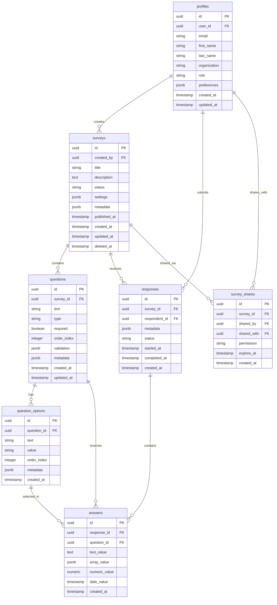

# Database Schema

## Overview

The Healthcare Survey Dashboard uses PostgreSQL as its primary database, hosted on Supabase. The schema is designed for scalability, data integrity, and performance with proper indexing and constraints.

## Entity Relationship Diagram



## Table Definitions

### profiles

Stores user profile information extending Supabase Auth.

```sql
CREATE TABLE profiles (
    id UUID PRIMARY KEY DEFAULT uuid_generate_v4(),
    user_id UUID REFERENCES auth.users(id) ON DELETE CASCADE,
    email TEXT UNIQUE NOT NULL,
    first_name TEXT NOT NULL,
    last_name TEXT NOT NULL,
    organization TEXT,
    role TEXT DEFAULT 'user' CHECK (role IN ('admin', 'user')),
    preferences JSONB DEFAULT '{}',
    created_at TIMESTAMPTZ DEFAULT NOW(),
    updated_at TIMESTAMPTZ DEFAULT NOW(),
    
    CONSTRAINT email_format CHECK (email ~* '^[A-Za-z0-9._%+-]+@[A-Za-z0-9.-]+\.[A-Za-z]{2,}$')
);

CREATE INDEX idx_profiles_user_id ON profiles(user_id);
CREATE INDEX idx_profiles_email ON profiles(email);
CREATE INDEX idx_profiles_organization ON profiles(organization) WHERE organization IS NOT NULL;
```

**JSONB Structure - preferences:**
```json
{
  "theme": "light | dark | system",
  "emailNotifications": true,
  "timezone": "America/New_York",
  "language": "en",
  "dashboardLayout": "grid | list"
}
```

### surveys

Core survey entity with all survey metadata.

```sql
CREATE TABLE surveys (
    id UUID PRIMARY KEY DEFAULT uuid_generate_v4(),
    created_by UUID REFERENCES profiles(id) ON DELETE SET NULL,
    title VARCHAR(200) NOT NULL,
    description TEXT,
    status TEXT DEFAULT 'draft' CHECK (status IN ('draft', 'active', 'completed', 'archived')),
    settings JSONB DEFAULT '{}',
    metadata JSONB DEFAULT '{}',
    published_at TIMESTAMPTZ,
    created_at TIMESTAMPTZ DEFAULT NOW(),
    updated_at TIMESTAMPTZ DEFAULT NOW(),
    deleted_at TIMESTAMPTZ,
    
    CONSTRAINT title_length CHECK (char_length(title) >= 3)
);

CREATE INDEX idx_surveys_created_by ON surveys(created_by);
CREATE INDEX idx_surveys_status ON surveys(status);
CREATE INDEX idx_surveys_published_at ON surveys(published_at) WHERE published_at IS NOT NULL;
CREATE INDEX idx_surveys_deleted_at ON surveys(deleted_at) WHERE deleted_at IS NOT NULL;
CREATE INDEX idx_surveys_created_at ON surveys(created_at DESC);
```

**JSONB Structure - settings:**
```json
{
  "allowAnonymous": false,
  "multipleSubmissions": false,
  "requireAuth": true,
  "randomizeQuestions": false,
  "showProgressBar": true,
  "confirmationMessage": "Thank you for your response",
  "redirectUrl": null,
  "startDate": "2025-01-01T00:00:00Z",
  "endDate": "2025-12-31T23:59:59Z",
  "maxResponses": 1000
}
```

**JSONB Structure - metadata:**
```json
{
  "tags": ["healthcare", "patient-satisfaction"],
  "category": "feedback",
  "version": 1,
  "estimatedTime": 5,
  "responseCount": 0,
  "averageCompletionTime": 0,
  "lastResponseAt": null
}
```

### questions

Survey questions with support for multiple types.

```sql
CREATE TABLE questions (
    id UUID PRIMARY KEY DEFAULT uuid_generate_v4(),
    survey_id UUID REFERENCES surveys(id) ON DELETE CASCADE,
    text TEXT NOT NULL,
    type TEXT NOT NULL CHECK (type IN ('text', 'textarea', 'multiple_choice', 'checkbox', 'rating', 'date', 'number', 'email', 'phone')),
    required BOOLEAN DEFAULT false,
    order_index INTEGER NOT NULL,
    validation JSONB DEFAULT '{}',
    metadata JSONB DEFAULT '{}',
    created_at TIMESTAMPTZ DEFAULT NOW(),
    updated_at TIMESTAMPTZ DEFAULT NOW(),
    
    CONSTRAINT text_length CHECK (char_length(text) >= 1 AND char_length(text) <= 500),
    CONSTRAINT unique_order_per_survey UNIQUE (survey_id, order_index)
);

CREATE INDEX idx_questions_survey_id ON questions(survey_id);
CREATE INDEX idx_questions_order ON questions(survey_id, order_index);
```

**JSONB Structure - validation:**
```json
{
  "minLength": 10,
  "maxLength": 500,
  "pattern": "^[A-Z].*",
  "min": 1,
  "max": 10,
  "minDate": "2025-01-01",
  "maxDate": "2025-12-31",
  "customMessage": "Please provide a valid response"
}
```

**JSONB Structure - metadata:**
```json
{
  "helpText": "Select all that apply",
  "placeholder": "Enter your response here",
  "conditionalLogic": {
    "showIf": {
      "questionId": "uuid",
      "operator": "equals",
      "value": "yes"
    }
  }
}
```

### question_options

Options for multiple choice and checkbox questions.

```sql
CREATE TABLE question_options (
    id UUID PRIMARY KEY DEFAULT uuid_generate_v4(),
    question_id UUID REFERENCES questions(id) ON DELETE CASCADE,
    text TEXT NOT NULL,
    value TEXT NOT NULL,
    order_index INTEGER NOT NULL,
    metadata JSONB DEFAULT '{}',
    created_at TIMESTAMPTZ DEFAULT NOW(),
    
    CONSTRAINT unique_value_per_question UNIQUE (question_id, value),
    CONSTRAINT unique_order_per_question UNIQUE (question_id, order_index)
);

CREATE INDEX idx_question_options_question_id ON question_options(question_id);
CREATE INDEX idx_question_options_order ON question_options(question_id, order_index);
```

### responses

Survey response submissions.

```sql
CREATE TABLE responses (
    id UUID PRIMARY KEY DEFAULT uuid_generate_v4(),
    survey_id UUID REFERENCES surveys(id) ON DELETE CASCADE,
    respondent_id UUID REFERENCES profiles(id) ON DELETE SET NULL,
    metadata JSONB DEFAULT '{}',
    status TEXT DEFAULT 'started' CHECK (status IN ('started', 'completed', 'abandoned')),
    started_at TIMESTAMPTZ DEFAULT NOW(),
    completed_at TIMESTAMPTZ,
    created_at TIMESTAMPTZ DEFAULT NOW(),
    
    CONSTRAINT completed_time_check CHECK (
        (status = 'completed' AND completed_at IS NOT NULL) OR
        (status != 'completed' AND completed_at IS NULL)
    )
);

CREATE INDEX idx_responses_survey_id ON responses(survey_id);
CREATE INDEX idx_responses_respondent_id ON responses(respondent_id) WHERE respondent_id IS NOT NULL;
CREATE INDEX idx_responses_status ON responses(status);
CREATE INDEX idx_responses_completed_at ON responses(completed_at DESC) WHERE completed_at IS NOT NULL;
```

**JSONB Structure - metadata:**
```json
{
  "ipAddress": "192.168.1.1",
  "userAgent": "Mozilla/5.0...",
  "referrer": "https://example.com",
  "device": "mobile",
  "browser": "Chrome",
  "os": "iOS",
  "completionTime": 245,
  "sessionId": "sess_123",
  "source": "email"
}
```

### answers

Individual answers to survey questions.

```sql
CREATE TABLE answers (
    id UUID PRIMARY KEY DEFAULT uuid_generate_v4(),
    response_id UUID REFERENCES responses(id) ON DELETE CASCADE,
    question_id UUID REFERENCES questions(id) ON DELETE CASCADE,
    text_value TEXT,
    array_value JSONB,
    numeric_value NUMERIC,
    date_value TIMESTAMPTZ,
    created_at TIMESTAMPTZ DEFAULT NOW(),
    
    CONSTRAINT unique_answer_per_response UNIQUE (response_id, question_id),
    CONSTRAINT at_least_one_value CHECK (
        text_value IS NOT NULL OR
        array_value IS NOT NULL OR
        numeric_value IS NOT NULL OR
        date_value IS NOT NULL
    )
);

CREATE INDEX idx_answers_response_id ON answers(response_id);
CREATE INDEX idx_answers_question_id ON answers(question_id);
```

### survey_shares

Sharing permissions for collaborative survey management.

```sql
CREATE TABLE survey_shares (
    id UUID PRIMARY KEY DEFAULT uuid_generate_v4(),
    survey_id UUID REFERENCES surveys(id) ON DELETE CASCADE,
    shared_by UUID REFERENCES profiles(id) ON DELETE CASCADE,
    shared_with UUID REFERENCES profiles(id) ON DELETE CASCADE,
    permission TEXT DEFAULT 'view' CHECK (permission IN ('view', 'edit', 'admin')),
    expires_at TIMESTAMPTZ,
    created_at TIMESTAMPTZ DEFAULT NOW(),
    
    CONSTRAINT unique_share UNIQUE (survey_id, shared_with),
    CONSTRAINT no_self_share CHECK (shared_by != shared_with)
);

CREATE INDEX idx_survey_shares_survey_id ON survey_shares(survey_id);
CREATE INDEX idx_survey_shares_shared_with ON survey_shares(shared_with);
CREATE INDEX idx_survey_shares_expires_at ON survey_shares(expires_at) WHERE expires_at IS NOT NULL;
```

## Views

### active_surveys

Surveys currently accepting responses.

```sql
CREATE VIEW active_surveys AS
SELECT 
    s.*,
    COUNT(DISTINCT r.id) as response_count,
    MAX(r.completed_at) as last_response_at
FROM surveys s
LEFT JOIN responses r ON r.survey_id = s.id AND r.status = 'completed'
WHERE s.status = 'active'
    AND s.deleted_at IS NULL
    AND (s.settings->>'startDate' IS NULL OR (s.settings->>'startDate')::timestamptz <= NOW())
    AND (s.settings->>'endDate' IS NULL OR (s.settings->>'endDate')::timestamptz >= NOW())
GROUP BY s.id;
```

### survey_analytics

Aggregated analytics for each survey.

```sql
CREATE VIEW survey_analytics AS
SELECT 
    s.id as survey_id,
    s.title,
    s.status,
    COUNT(DISTINCT r.id) FILTER (WHERE r.status = 'completed') as completed_responses,
    COUNT(DISTINCT r.id) FILTER (WHERE r.status = 'started') as started_responses,
    COUNT(DISTINCT r.id) FILTER (WHERE r.status = 'abandoned') as abandoned_responses,
    AVG(EXTRACT(EPOCH FROM (r.completed_at - r.started_at))) as avg_completion_seconds,
    MIN(r.started_at) as first_response_at,
    MAX(r.completed_at) as last_response_at,
    COUNT(DISTINCT r.respondent_id) as unique_respondents
FROM surveys s
LEFT JOIN responses r ON r.survey_id = s.id
GROUP BY s.id, s.title, s.status;
```

### question_response_rates

Response rates for individual questions.

```sql
CREATE VIEW question_response_rates AS
SELECT 
    q.id as question_id,
    q.survey_id,
    q.text as question_text,
    q.required,
    COUNT(DISTINCT r.id) as total_responses,
    COUNT(DISTINCT a.response_id) as answered_count,
    CASE 
        WHEN COUNT(DISTINCT r.id) > 0 
        THEN (COUNT(DISTINCT a.response_id)::FLOAT / COUNT(DISTINCT r.id)::FLOAT * 100)
        ELSE 0 
    END as response_rate
FROM questions q
LEFT JOIN responses r ON r.survey_id = q.survey_id AND r.status = 'completed'
LEFT JOIN answers a ON a.question_id = q.id AND a.response_id = r.id
GROUP BY q.id, q.survey_id, q.text, q.required;
```

## Functions

### update_updated_at()

Automatically update `updated_at` timestamp.

```sql
CREATE OR REPLACE FUNCTION update_updated_at()
RETURNS TRIGGER AS $$
BEGIN
    NEW.updated_at = NOW();
    RETURN NEW;
END;
$$ LANGUAGE plpgsql;
```

### calculate_completion_rate()

Calculate survey completion rate.

```sql
CREATE OR REPLACE FUNCTION calculate_completion_rate(survey_uuid UUID)
RETURNS NUMERIC AS $$
DECLARE
    total_responses INTEGER;
    completed_responses INTEGER;
BEGIN
    SELECT 
        COUNT(*) FILTER (WHERE status IN ('started', 'completed', 'abandoned')),
        COUNT(*) FILTER (WHERE status = 'completed')
    INTO total_responses, completed_responses
    FROM responses
    WHERE survey_id = survey_uuid;
    
    IF total_responses = 0 THEN
        RETURN 0;
    END IF;
    
    RETURN ROUND((completed_responses::NUMERIC / total_responses::NUMERIC * 100), 2);
END;
$$ LANGUAGE plpgsql;
```

### get_survey_summary()

Get comprehensive survey summary.

```sql
CREATE OR REPLACE FUNCTION get_survey_summary(survey_uuid UUID)
RETURNS TABLE (
    total_responses BIGINT,
    completed_responses BIGINT,
    completion_rate NUMERIC,
    avg_completion_time INTERVAL,
    unique_respondents BIGINT,
    last_response_at TIMESTAMPTZ
) AS $$
BEGIN
    RETURN QUERY
    SELECT 
        COUNT(*) as total_responses,
        COUNT(*) FILTER (WHERE status = 'completed') as completed_responses,
        calculate_completion_rate(survey_uuid) as completion_rate,
        AVG(completed_at - started_at) FILTER (WHERE status = 'completed') as avg_completion_time,
        COUNT(DISTINCT respondent_id) as unique_respondents,
        MAX(completed_at) as last_response_at
    FROM responses
    WHERE survey_id = survey_uuid;
END;
$$ LANGUAGE plpgsql;
```

## Triggers

### Update Timestamps

```sql
CREATE TRIGGER update_profiles_updated_at
    BEFORE UPDATE ON profiles
    FOR EACH ROW
    EXECUTE FUNCTION update_updated_at();

CREATE TRIGGER update_surveys_updated_at
    BEFORE UPDATE ON surveys
    FOR EACH ROW
    EXECUTE FUNCTION update_updated_at();

CREATE TRIGGER update_questions_updated_at
    BEFORE UPDATE ON questions
    FOR EACH ROW
    EXECUTE FUNCTION update_updated_at();
```

### Update Survey Metadata

```sql
CREATE OR REPLACE FUNCTION update_survey_metadata()
RETURNS TRIGGER AS $$
BEGIN
    IF TG_OP = 'INSERT' OR TG_OP = 'UPDATE' THEN
        IF NEW.status = 'completed' THEN
            UPDATE surveys
            SET metadata = jsonb_set(
                jsonb_set(
                    metadata,
                    '{responseCount}',
                    (SELECT COUNT(*)::TEXT FROM responses WHERE survey_id = NEW.survey_id AND status = 'completed')::JSONB
                ),
                '{lastResponseAt}',
                to_jsonb(NEW.completed_at)
            )
            WHERE id = NEW.survey_id;
        END IF;
    END IF;
    RETURN NEW;
END;
$$ LANGUAGE plpgsql;

CREATE TRIGGER update_survey_metadata_on_response
    AFTER INSERT OR UPDATE ON responses
    FOR EACH ROW
    EXECUTE FUNCTION update_survey_metadata();
```

## Indexes

### Performance Indexes

```sql
-- Full-text search on surveys
CREATE INDEX idx_surveys_search ON surveys 
    USING gin(to_tsvector('english', title || ' ' || COALESCE(description, '')));

-- JSONB indexes for common queries
CREATE INDEX idx_surveys_settings_anonymous ON surveys ((settings->>'allowAnonymous'));
CREATE INDEX idx_surveys_metadata_tags ON surveys USING gin((metadata->'tags'));
CREATE INDEX idx_responses_metadata_device ON responses ((metadata->>'device'));

-- Partial indexes for common filters
CREATE INDEX idx_active_surveys ON surveys(created_at DESC) 
    WHERE status = 'active' AND deleted_at IS NULL;
CREATE INDEX idx_completed_responses ON responses(completed_at DESC) 
    WHERE status = 'completed';
```

## Constraints

### Foreign Key Constraints

All foreign keys have appropriate `ON DELETE` actions:
- `CASCADE`: Deletes dependent records (questions, answers)
- `SET NULL`: Preserves records but removes reference (respondent_id)
- `RESTRICT`: Prevents deletion if dependencies exist

### Check Constraints

- Email format validation
- Status enumerations
- Date range validations
- Text length limits
- Numeric range validations

## Migration Strategy

### Version Control

All schema changes are versioned using sequential migration files:

```
migrations/
├── 001_initial_schema.sql
├── 002_add_survey_shares.sql
├── 003_add_analytics_views.sql
└── 004_add_performance_indexes.sql
```

### Rollback Support

Each migration includes both `up` and `down` scripts:

```sql
-- up
CREATE TABLE new_table (...);

-- down
DROP TABLE IF EXISTS new_table;
```

## Performance Considerations

1. **Indexing Strategy**
   - Index foreign keys for JOIN performance
   - Partial indexes for filtered queries
   - JSONB GIN indexes for metadata queries

2. **Partitioning**
   - Consider partitioning `responses` table by `created_at` for large datasets
   - Archive old responses to separate tables

3. **Query Optimization**
   - Use views for complex repeated queries
   - Implement materialized views for analytics
   - Regular `VACUUM` and `ANALYZE` operations

4. **Connection Pooling**
   - Use Supabase connection pooler
   - Configure appropriate pool sizes
   - Implement query timeout limits

## Security Considerations

1. **Row Level Security (RLS)**
   - All tables have RLS enabled
   - Policies enforce data access rules
   - See [RLS Policies](./rls-policies.md) for details

2. **Data Encryption**
   - Sensitive data encrypted at rest
   - TLS for data in transit
   - Encrypted backups

3. **Audit Logging**
   - All data modifications logged
   - User actions tracked
   - Compliance with HIPAA requirements