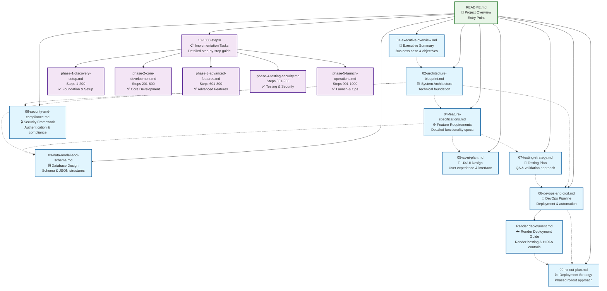

# Project Structure Flowchart

This document provides a visual flowchart showing the relationships and dependencies between all documentation files in the Survey Web Application implementation plan.

## Project Documentation Flow

## Document Relationships & Dependencies

### 📋 Reading Order Recommendations

**Phase 1: Understanding the Project**
1. `README.md` - Start here for project overview
2. `01-executive-overview.md` - Business context and objectives
3. `02-architecture-blueprint.md` - Technical foundation

**Phase 2: Core Design**
4. `03-data-model-and-schema.md` - Database structure
5. `04-feature-specifications.md` - Detailed requirements
6. `05-ux-ui-plan.md` - User interface design

**Phase 3: Implementation Planning**
7. `06-security-and-compliance.md` - Security requirements
8. `07-testing-strategy.md` - Quality assurance approach
9. `08-devops-and-cicd.md` - Deployment pipeline
10. `Render deployment.md` - Platform-specific deployment runbook for Render with HIPAA considerations

**Phase 4: Execution**
11. `09-rollout-plan.md` - Deployment strategy
12. `10-1000-steps/phase-1-discovery-setup.md` - Foundation setup tasks (Steps 1-200)
13. `10-1000-steps/phase-2-core-development.md` - Core platform build (Steps 201-600)
14. `10-1000-steps/phase-3-advanced-features.md` - Advanced capabilities (Steps 601-800)
15. `10-1000-steps/phase-4-testing-security.md` - Testing & hardening (Steps 801-900)
16. `10-1000-steps/phase-5-launch-operations.md` - Launch & operations (Steps 901-1000)

### 🔗 Key Dependencies

| Document | Depends On | Provides Foundation For |
|----------|------------|------------------------|
| Architecture Blueprint | Executive Overview | Data Model, Security, DevOps |
| Data Model & Schema | Architecture, Features | All implementation phases |
| Feature Specifications | Architecture | UX/UI, Testing, Data Model |
| UX/UI Plan | Features | Testing Strategy |
| Security & Compliance | Architecture | DevOps, Testing |
| Testing Strategy | Features, UX/UI | DevOps |
| DevOps & CI/CD | Architecture, Security, Testing | Rollout Plan |
| Rollout Plan | All previous documents | Implementation execution |
| Render Deployment Guide | DevOps & CI/CD, Security & Compliance | Rollout Plan |

### 📁 File Status Summary

| Status | Count | Files |
|--------|-------|-------|
| ✅ Complete | 16 | README + 01-09 + Render deployment + phases 1-5 |
| ❌ Missing | 0 | — |
| **Total** | **16** | **Planned documentation files** |

### 🎯 Phase Implementation Files

All five phase files now exist with the same detailed structure established in `phase-1-discovery-setup.md`, providing actionable tasks, deliverables, and success criteria across the entire 1000-step roadmap.

### 🏗️ Document Structure Patterns

Each main document (01-09) follows a consistent structure:
- Clear section organization
- Implementation details
- Success criteria
- Risk mitigation strategies

The phase files use a task-oriented structure:
- Step ranges (e.g., 1-50, 51-100)
- Detailed action items
- Technical deliverables
- Quality gates

`Render deployment.md` builds on the DevOps plan with Render-specific infrastructure configuration, HIPAA workspace requirements, and operational checklists.

This flowchart serves as a navigation guide for the comprehensive survey web application implementation documentation.
