# Project Structure Flowchart

This document provides a visual flowchart showing the relationships and dependencies between all documentation files in the Survey Web Application implementation plan.

## Project Documentation Flow

```mermaid
flowchart TD
    README[README.md<br/>📖 Project Overview<br/>Entry Point] --> EXEC[01-executive-overview.md<br/>🎯 Executive Summary<br/>Business case & objectives]
    
    README --> ARCH[02-architecture-blueprint.md<br/>🏗️ System Architecture<br/>Technical foundation]
    
    README --> DATA[03-data-model-and-schema.md<br/>🗄️ Database Design<br/>Schema & JSON structures]
    
    README --> FEAT[04-feature-specifications.md<br/>⚙️ Feature Requirements<br/>Detailed functionality specs]
    
    README --> UX[05-ux-ui-plan.md<br/>🎨 UX/UI Design<br/>User experience & interface]
    
    README --> SEC[06-security-and-compliance.md<br/>🔒 Security Framework<br/>Authentication & compliance]
    
    README --> TEST[07-testing-strategy.md<br/>🧪 Testing Plan<br/>QA & validation approach]
    
    README --> DEVOPS[08-devops-and-cicd.md<br/>🚀 DevOps Pipeline<br/>Deployment & automation]
    
    README --> ROLLOUT[09-rollout-plan.md<br/>📈 Deployment Strategy<br/>Phased rollout approach]
    
    README --> STEPS[10-1000-steps/<br/>📋 Implementation Tasks<br/>Detailed step-by-step guide]
    
    %% Dependencies between documents
    EXEC -.-> ARCH
    ARCH -.-> DATA
    ARCH -.-> FEAT
    FEAT -.-> DATA
    FEAT -.-> UX
    ARCH -.-> SEC
    FEAT -.-> TEST
    ARCH -.-> DEVOPS
    TEST -.-> DEVOPS
    DEVOPS -.-> ROLLOUT
    
    %% 1000 Steps breakdown
    STEPS --> P1[phase-1-discovery-setup.md<br/>Steps 1-200<br/>✅ Foundation & Setup]
    STEPS --> P2[phase-2-core-development.md<br/>Steps 201-600<br/>❌ Missing File]
    STEPS --> P3[phase-3-advanced-features.md<br/>Steps 601-800<br/>❌ Missing File]
    STEPS --> P4[phase-4-testing-security.md<br/>Steps 801-900<br/>❌ Missing File]
    STEPS --> P5[phase-5-launch-operations.md<br/>Steps 901-1000<br/>❌ Missing File]
    
    %% Style the nodes
    classDef mainDocs fill:#e1f5fe,stroke:#01579b,stroke-width:2px
    classDef phaseDocs fill:#f3e5f5,stroke:#4a148c,stroke-width:2px
    classDef missingDocs fill:#ffebee,stroke:#b71c1c,stroke-width:2px,stroke-dasharray: 5 5
    classDef readmeNode fill:#e8f5e8,stroke:#2e7d32,stroke-width:3px
    
    class README readmeNode
    class EXEC,ARCH,DATA,FEAT,UX,SEC,TEST,DEVOPS,ROLLOUT mainDocs
    class STEPS,P1 phaseDocs
    class P2,P3,P4,P5 missingDocs
```

## Document Relationships & Dependencies

### 📋 Reading Order Recommendations

**Phase 1: Understanding the Project**
1. `README.md` - Start here for project overview
2. `01-executive-overview.md` - Business context and objectives
3. `02-architecture-blueprint.md` - Technical foundation

**Phase 2: Core Design**
4. `03-data-model-and-schema.md` - Database structure
5. `04-feature-specifications.md` - Detailed requirements
6. `05-ux-ui-plan.md` - User interface design

**Phase 3: Implementation Planning**
7. `06-security-and-compliance.md` - Security requirements
8. `07-testing-strategy.md` - Quality assurance approach
9. `08-devops-and-cicd.md` - Deployment pipeline

**Phase 4: Execution**
10. `09-rollout-plan.md` - Deployment strategy
11. `10-1000-steps/phase-1-discovery-setup.md` - Implementation tasks

### 🔗 Key Dependencies

| Document | Depends On | Provides Foundation For |
|----------|------------|------------------------|
| Architecture Blueprint | Executive Overview | Data Model, Security, DevOps |
| Data Model & Schema | Architecture, Features | All implementation phases |
| Feature Specifications | Architecture | UX/UI, Testing, Data Model |
| UX/UI Plan | Features | Testing Strategy |
| Security & Compliance | Architecture | DevOps, Testing |
| Testing Strategy | Features, UX/UI | DevOps |
| DevOps & CI/CD | Architecture, Security, Testing | Rollout Plan |
| Rollout Plan | All previous documents | Implementation execution |

### 📁 File Status Summary

| Status | Count | Files |
|--------|-------|-------|
| ✅ Complete | 10 | README + 01-09 + phase-1 |
| ❌ Missing | 4 | phase-2 through phase-5 |
| **Total** | **14** | **Planned documentation files** |

### 🎯 Missing Implementation Files

The following phase files from the 1000-step implementation plan are missing:

- `phase-2-core-development.md` (Steps 201-600)
- `phase-3-advanced-features.md` (Steps 601-800)  
- `phase-4-testing-security.md` (Steps 801-900)
- `phase-5-launch-operations.md` (Steps 901-1000)

These files should follow the same detailed structure as `phase-1-discovery-setup.md`, breaking down their respective step ranges into actionable tasks with deliverables and success criteria.

### 🏗️ Document Structure Patterns

Each main document (01-09) follows a consistent structure:
- Clear section organization
- Implementation details
- Success criteria
- Risk mitigation strategies

The phase files use a task-oriented structure:
- Step ranges (e.g., 1-50, 51-100)
- Detailed action items
- Technical deliverables
- Quality gates

This flowchart serves as a navigation guide for the comprehensive survey web application implementation documentation.